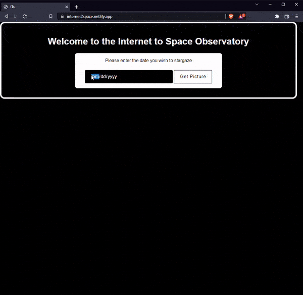
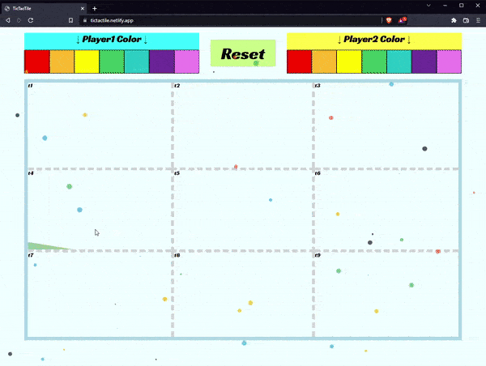
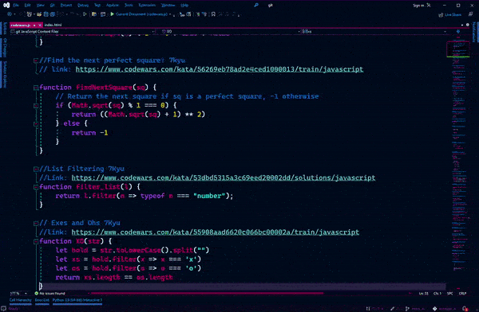
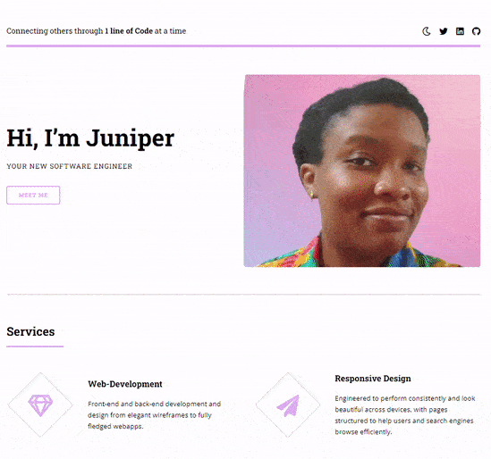

### Hi there 👋 
I'm a fullstack enginner motivated by the power of technology as a tool for positive change, with a background in Neuroscience, Data Analytics and Music.

<h1 align="center">Projects</h1>
<table bordercolor="#66b2b2">
  
  <tr>
    <td width="50%" valign="top">
      <h3 align="center">ITs (Internet To Space-observatory)</h3>
         
        
         
        

          
    
  
      

        
<strong>Javascript, HTML, CSS, Nasa API</strong> - Platform to help build momentous milestones along with your friends and family! Travelara makes Dream Trips a Reality!

    </td>
    <td width="50%" valign="top">
      <h3 align="center">TicTacTile</h3>
         
      
         
        

          
  
  
      

        
<strong>HTML5, CSS3, Javascript & Howler.js</strong>Anarchy Tic Tac Toe game allows players to take their oppoent's tiles, but game must finish after 9 turns.

    </td>
  </tr>
  
  <tr>
    <td width="50%" valign="top">
      <h3 align="center"Codewars Challenges</h3>
         
        
         
        

          
  
        
Codewars Challenges

    </td>
	<td width="50%" valign="top">
      <h3 align="center">Portfolio</h3>
       
        
       
        

  
  
      

        
<strong>HTML5, CSS3, & Javascript</strong> - Portfolio Site including links to my projects, ways to contact me.

    </td>
  </tr>

</table>

<!--
**Pressedj/pressedj** is a ✨ _special_ ✨ repository because its `README.md` (this file) appears on your GitHub profile.

Here are some ideas to get you started:

- 🔭 I’m currently working on ...
- 🌱 I’m currently learning ...
- 👯 I’m looking to collaborate on ...
- 🤔 I’m looking for help with ...
- 💬 Ask me about ...
- 📫 How to reach me: ...
- 😄 Pronouns: ...
- ⚡ Fun fact: ...
-->
